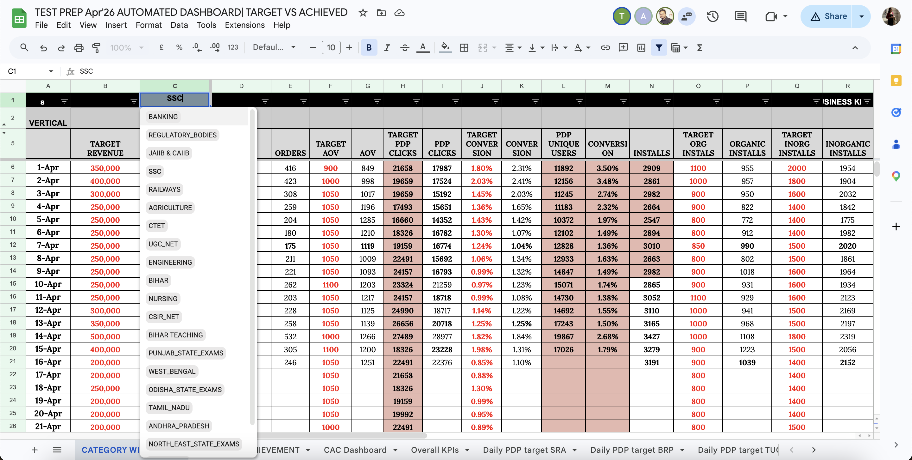
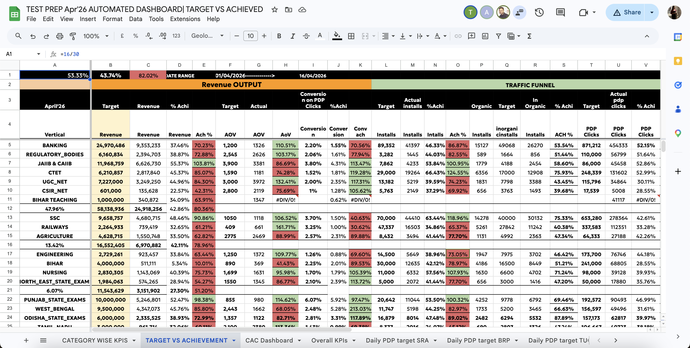
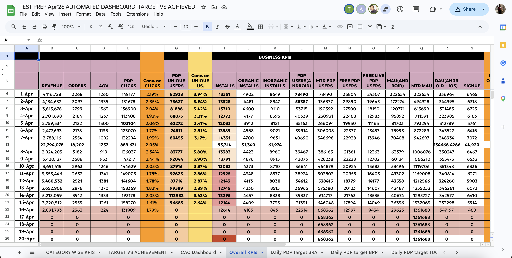

# google-sheets-kpi-automation-

# Business KPI Automation & Decision Intelligence System

🔗 **Live Dashboard (Google Sheets):** [Paste your Google Sheet link here]

---

## 🧠 Overview

This project is a centralized KPI tracking and reporting system built using Google Sheets to enable real-time business performance monitoring.

It tracks 25+ key business metrics across multiple dimensions and provides structured views for operational, tactical, and executive decision-making.

---

## 💡 Problem Statement

Business teams often rely on fragmented and manual reporting across multiple sheets, leading to:
- Delayed insights and slow decision-making
- Inconsistent KPI definitions
- Lack of visibility across business verticals
- High manual effort in daily reporting

---

## 🚀 Solution

Designed a scalable KPI automation system that:
- Tracks 25+ business KPIs across revenue, funnel, and user engagement
- Provides multi-level views for different stakeholders
- Enables daily performance monitoring (D-1 level)
- Centralizes business reporting into a single system

---

## 📊 Key Features

### 🔹 1. Vertical-Level KPI Dashboard
- Category-wise performance tracking for different business verticals
- Enables vertical heads to monitor:
  - Revenue
  - Orders
  - AOV (Average Order Value)
  - Conversion Rate
  - Installs & User Activity

---

### 🔹 2. Target vs Achievement (D-1 Tracking)
- Dynamic date filter for daily performance tracking
- Compares actual performance against predefined targets
- Highlights underperformance areas for quick action

---

### 🔹 3. Overall Business KPI Dashboard
- Aggregated view of entire business performance
- Tracks end-to-end funnel:
  
  **Installs → PDP Clicks → Conversion → Revenue**

- Provides executive-level visibility into key metrics

---

### 🔹 4. Advanced KPI Coverage
Tracks 25+ KPIs including:
- Revenue, Orders, AOV
- Conversion Rates (PDP, overall funnel)
- Installs (Organic vs Inorganic)
- MAU, DAU, Signups
- User engagement metrics

---

## ⚙️ KPI Logic & Calculations

Some key metric definitions:

- **Conversion Rate** = Orders / PDP Clicks  
- **AOV (Average Order Value)** = Revenue / Orders  
- **Achievement %** = Actual / Target  
- **Funnel Metrics** tracked across installs → clicks → conversions  

---

## 🏗️ System Architecture

---

## 📸 Dashboard Views

### 🔹 Vertical KPI View

### 🔹 Target vs Achievement View

### 🔹 Overall Business KPIs

---

## 📈 Business Impact

- Centralized KPI tracking across multiple business verticals
- Enabled faster daily decision-making with D-1 tracking
- Improved visibility into funnel inefficiencies
- Reduced dependency on manual reporting workflows
- Standardized KPI definitions across business functions

---

## 🧠 Key Learnings

- Designing scalable KPI frameworks for business reporting
- Structuring multi-dimensional data for analysis
- Building decision-focused dashboards (not just visualizations)
- Translating business problems into measurable metrics

---

## 🔧 Tech Stack

- Google Sheets
- Advanced Formulas & Pivot Tables
- (Optional) Google Apps Script for automation

---

## 📂 Repository Structure

---

## 🚀 Future Improvements

- Automate daily data refresh using Google Apps Script
- Add anomaly detection for KPI deviations
- Integrate automated email reporting
- Connect to external data sources (APIs / databases)

---

## 👤 Author

Garima Mahendru  
Data Analyst  

---
